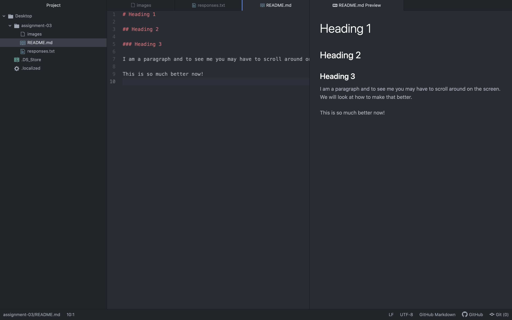

# Heading 1

## Heading 2

### Heading 3

I am a paragraph and to see me you may have to scroll around on the screen. We will look at how to make that better.

This is so much better now!

Three things I have learned in this class so far include the following: the difference between web designers and web developers, the definition of HTML, as well as the correct format in which to name files. 

[Website of Interest](https://www.google.com/?client=safari)

[My Responses](./responses.txt)

