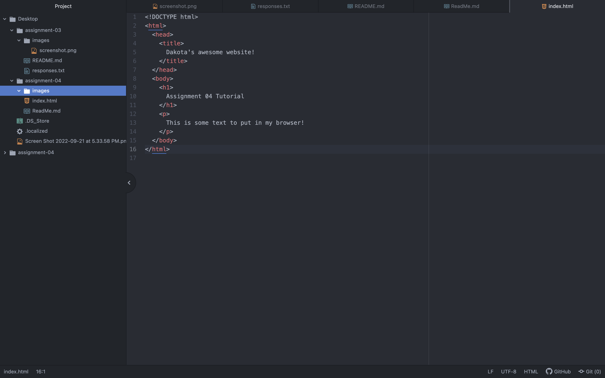

Browsers function as follows: When viewing a webpage, you send a request over the network to a server. It responds with a collection of web content as a response. The browser interprets the content returned and plays the page.

I currently use the browser, Safari.

