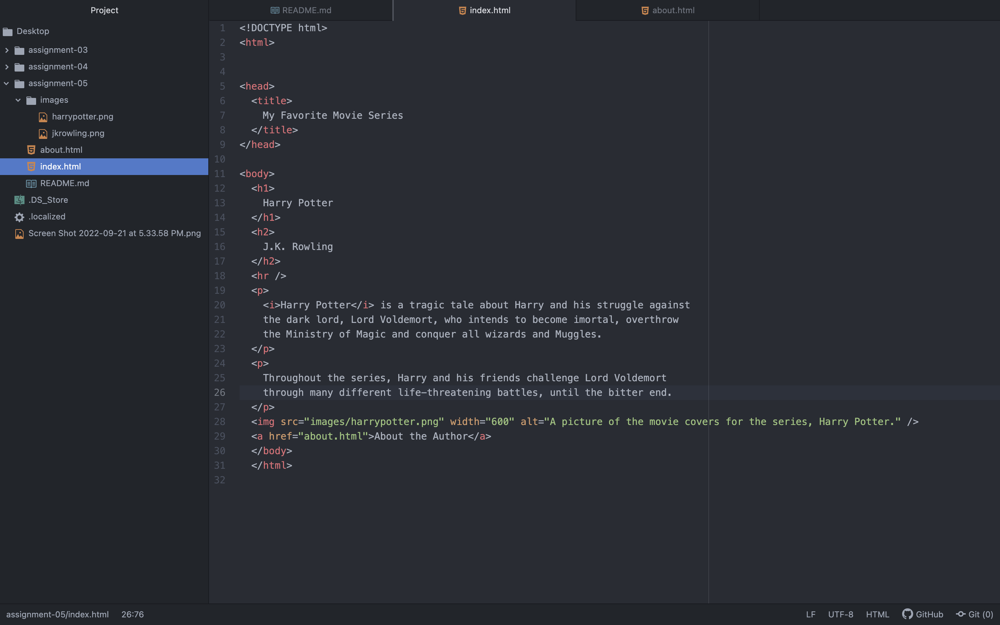

While using The Wayback Machine website, I visited the website https://www.amazon.com. I looked at the first available date, December, 12 1998; this version is extraordinarily different from the current version of the website that its users have today. The older version is very simple with lots of white space, randomly placed imagery built around the text, and a ton of hyperlinks. The newer version is very complex, there is lots of color and movement; it is inviting and user friendly.

