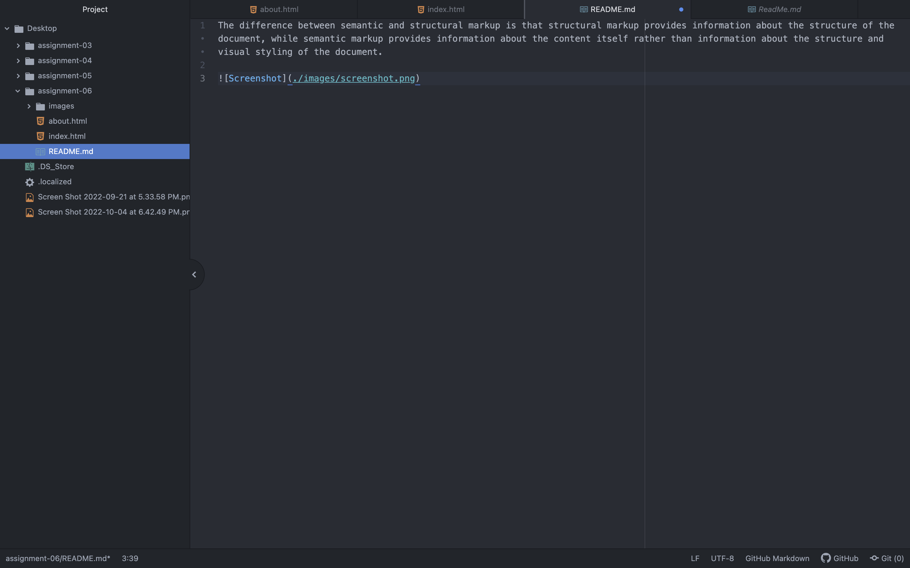

The difference between semantic and structural markup is that structural markup provides information about the structure of the document, while semantic markup provides information about the content itself rather than information about the structure and visual styling of the document.

