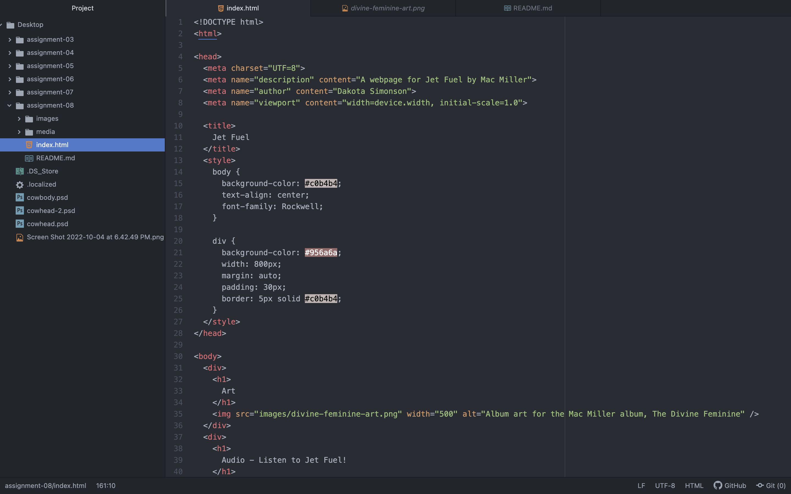

What is affordance?
  Affordance is the set of possible actions for an object, it is flexible in the definition of "possible actions". On the other hand, there is digital affordance which is defined the same, with the addition of that it must be learned through interaction; it is inflexible.

What are the advantages and disadvantages of using a third-party service like Youtube or Vimeo to host your videos?
  According to the class website, a disadvantage of using a third-party service is that you will not have access to the original file, and therefore will not be able to correctly re-format or compress it.
  -not ideal for image files
  -any unlicensed material used without permission can be crawled and reported
  -can become costly to upgrade storage and/or services
  According to the class website, an advantage of using a third-party service is that you are provided with affordable solutions to the potential problem of exhausted bandwidth.
  -ideal for video and audio files
  -can host large/high quality versions of files
  -will handle compatibility, encoding, and the other details necessary for the media to play on a variety of browsers

