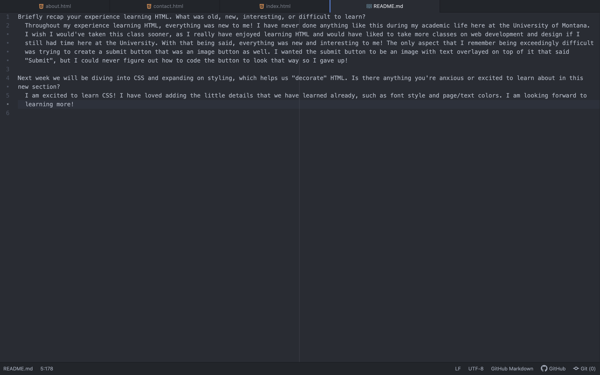

Briefly recap your experience learning HTML. What was old, new, interesting, or difficult to learn?
  Throughout my experience learning HTML, everything was new to me! I have never done anything like this during my academic life here at the University of Montana. I wish I would've taken this class sooner, as I really have enjoyed learning HTML and would have liked to take more classes on web development and design if I still had time here at the University. With that being said, everything was new and interesting to me! The only aspect that I remember being exceedingly difficult was trying to create a submit button that was an image button as well. I wanted the submit button to be an image with text overlayed on top of it that said "Submit", but I could never figure out how to code the button to look that way so I gave up!

Next week we will be diving into CSS and expanding on styling, which helps us "decorate" HTML. Is there anything you're anxious or excited to learn about in this new section?
  I am excited to learn CSS! I have loved adding the little details that we have learned already, such as font style and page/text colors. I am looking forward to learning more!

  
