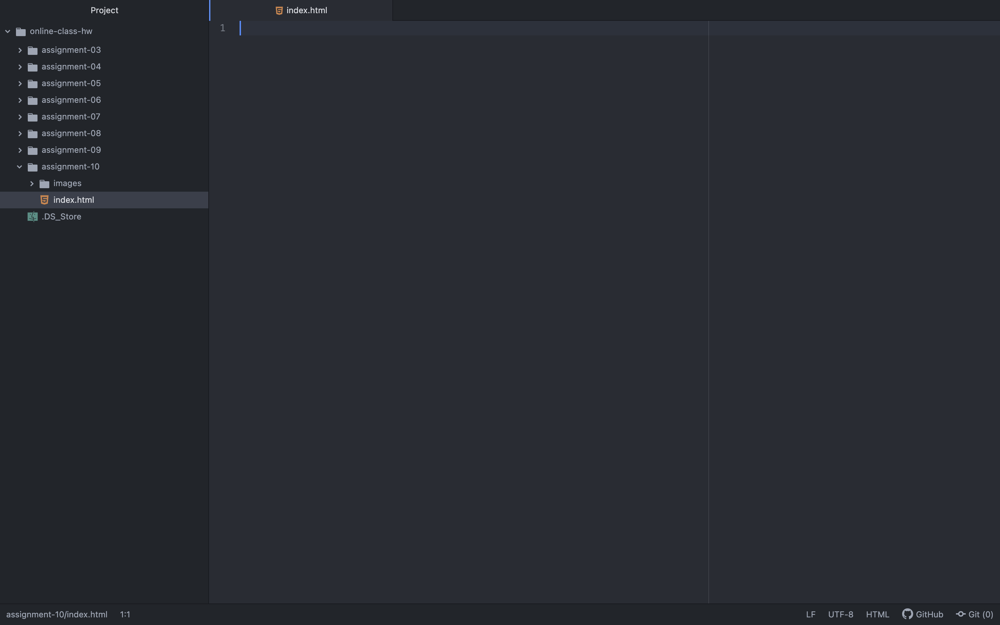

Describe the difference between the universal, element, class, and ID selector types. When might you choose one over the other to style content?
  According to the class website, the universal selector type is used to style every element on a page; the element selector is used to select all elements of a certain type; the class selector is a great way to select elements that serve the same function; and the ID selector allows developers to define style rule for a specific elements by calling its unique ID.  When choosing a selector to style content, you might choose a specific selector such as the ID selector to only apply the style to a few or one element. Whereas, you might choose a general selector, such as the universal selector, to apply the style to all the elements. 

Discuss your color palette. How did you choose your colors?
  The color palette that I chose to work with for this assignment was based on an illustration from which I have drawn inspiration as to what I want my brand identity to look like. I purposely have chosen an image that features earthy colors, complementary colors, along with a dramatic pop of a bright red color.

  
