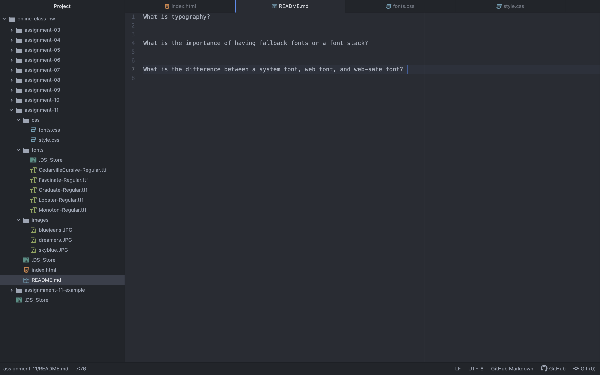

What is typography?
  Typography is about organizing textual information and how we can present it optimally to our users; good typography invites the user into the content of your webpage.

What is the importance of having fallback fonts or a font stack?
  Fallback fonts are important for when a users browser cannot load the primary font, there are secondary options.

What is the difference between a system font, web font, and web-safe font?
  System fonts are those fonts already installed on your local device system; these fonts should be limited to logos and other branding purposes, as they must be exported as images. Web fonts are custom fonts hosted on a server, they are optimized for performing on the web. Web safe fonts are dependable fonts for developers because they are widely available and are accepted by both Windows and Mac. 

  
