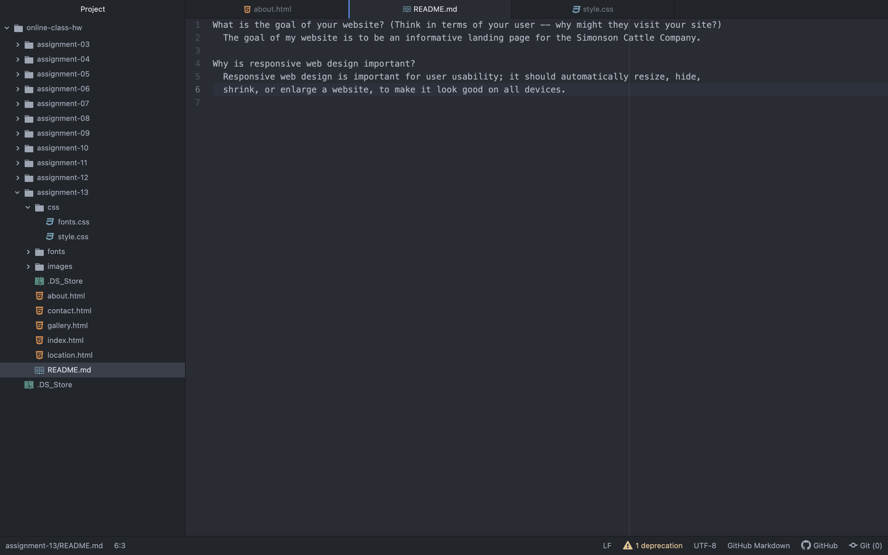

What is the goal of your website? (Think in terms of your user -- why might they visit your site?)
  The goal of my website is to be an informative landing page for the Simonson Cattle Company.

Why is responsive web design important?
  Responsive web design is important for user usability; it should automatically resize, hide,
  shrink, or enlarge a website, to make it look good on all devices.

