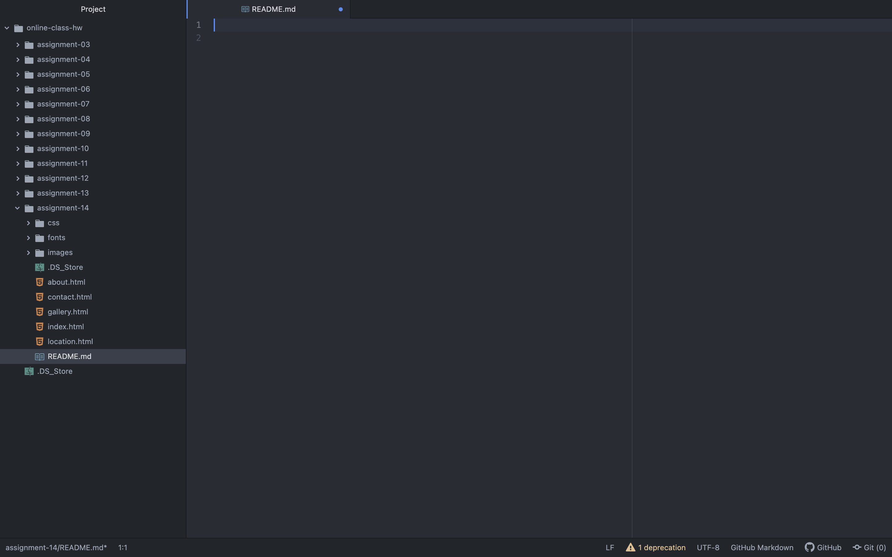

How did your user testing sessions go?
  They went well! Since I had my friends do the tests, I feel like the feedback I received was not very critical. But, overall the experience was beneficial as I learned how to conduct a user testing sessions, and what I should and shouldn't do if I were to conduct another future test.

What changes (if any) did you make to your website based on the user feedback you received?
  The changes I made to my website this week were the addition of the "Location" and "Gallery" pages. I feel confident in my website as a complete project, but I do wonder if my website has been properly coded to be readable if a user were to access the website from their phone.

